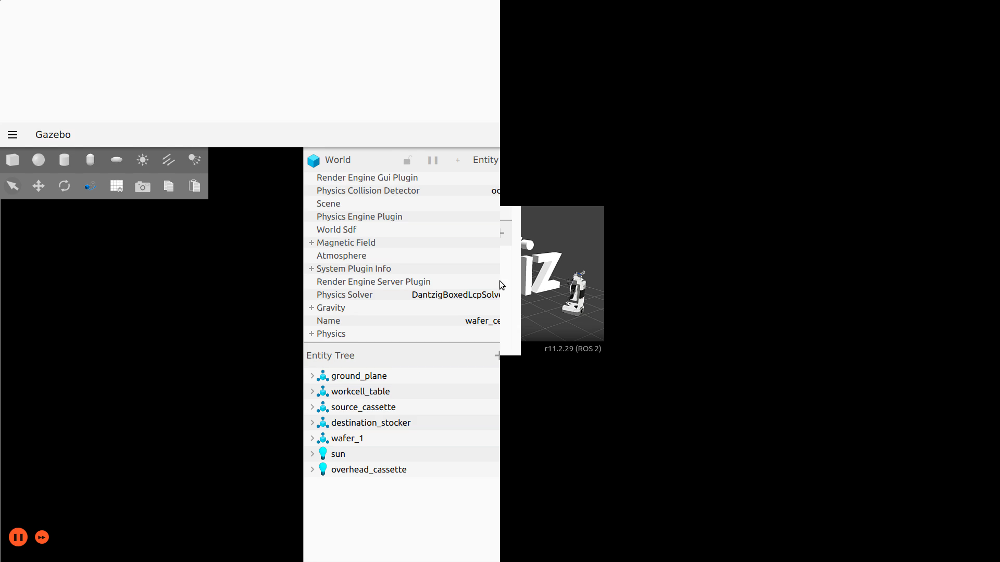
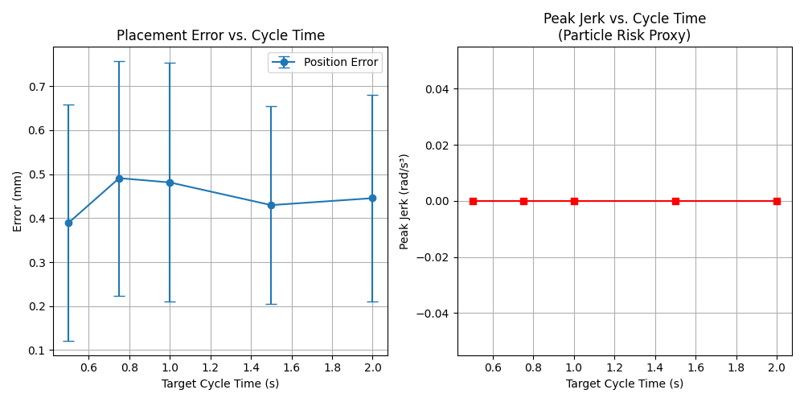

<div align="center">

# 🤖 WaferFlow
### Precision SCARA Wafer Handling Simulation & Control Stack

*A full-stack robotics software project demonstrating proprietary trajectory planning, computer vision alignment, and real-time web telemetry for semiconductor wafer handling*

<video src="media/waferflow_demo.mp4" width="100%" controls autoplay loop muted></video>



---

[](https://docs.ros.org/en/humble/)
[](https://gazebosim.org/)
[](https://www.python.org/)
[](https://nextjs.org/)
[](https://opencv.org/)
[](https://threejs.org/)

</div>

---

## 📋 Table of Contents

1. [Project Overview](#-project-overview)
2. [Problem Statement](#-problem-statement)
3. [Key Features](#-key-features)
4. [Technology Stack](#%EF%B8%8F-technology-stack)
5. [System Architecture](#-system-architecture)
6. [ROS 2 Package Breakdown](#-ros-2-package-breakdown)
7. [Robot Description](#-robot-description)
8. [Custom ROS 2 Interfaces](#-custom-ros-2-interfaces)
9. [Trajectory Planning Deep Dive](#-trajectory-planning-deep-dive)
10. [Computer Vision Pipeline](#-computer-vision-pipeline)
11. [Web Telemetry Dashboard](#-web-telemetry-dashboard)
12. [ROS Topics, Services & Actions](#-ros-topics-services--actions)
13. [Prerequisites & Installation](#-prerequisites--installation)
14. [Build & Run](#-build--run)
15. [Benchmark Results](#-benchmark--design-review-results)

---

## 🎯 Project Overview

**WaferFlow** is a complete, production-quality ROS 2 software stack for controlling a proprietary **4-DOF SCARA robot** designed for semiconductor wafer handling. The project spans the full robotics software development lifecycle:

- **Mechanical Modeling** — Custom URDF/Xacro robot model with real dimensions, inertia tensors, and joint limits
- **Physics Simulation** — Ignition Gazebo Fortress with `ign_ros2_control` hardware interface and detachable vacuum gripper physics
- **Proprietary Control** — Analytical Inverse Kinematics solver and a custom S-curve trajectory generator (bypassing generic planners)
- **State Machine** — Finite State Machine (FSM) orchestrating the exact industrial pick-and-place sequence
- **Computer Vision** — OpenCV-based overhead camera pipeline for real-time wafer misalignment detection
- **Benchmarking** — Automated sweep testing to characterize the throughput vs. precision Pareto frontier
- **Web Dashboard** — Next.js 14 control center with live joint telemetry, 3D digital twin WebGL visualization, and a virtual joystick

---

## 🏭 Problem Statement

In semiconductor fabrication, silicon wafers (100mm to 300mm diameter, ~0.75mm thick) are transported between process stations by SCARA robots operating inside cleanrooms. Two competing engineering requirements create a fundamental tradeoff:

| Requirement | Engineering Constraint |
|---|---|
| **Maximize throughput** | Minimize cycle time → requires high velocity/acceleration |
| **Minimize particle contamination** | Limit mechanical jerk → high jerk → vibrations → particles |
| **Placement accuracy** | Sub-millimeter precision required at destination slot |

> **Standard ROS 2 trajectory planners (TOTG, CHOMP, OMPL) use trapezoidal velocity profiles with theoretically infinite jerk at transition points.** This is unacceptable in a semiconductor fab environment where particle generation directly causes wafer defects and yield loss.

**WaferFlow solves this** by implementing a proprietary 7-phase S-curve trajectory generator that enforces a hard **J_max** (jerk limit) constraint, making the throughput–precision tradeoff quantifiable and configurable at runtime.

---

## 🚀 Key Features

| Feature | Details |
|---|---|
| **Proprietary S-Curve Planner** | 7-phase piecewise polynomial (Biagiotti & Melchiorri), ND joint-space, replaces MoveIt TOTG |
| **Finite State Machine** | 8-state FSM (`IDLE→APPROACH→ALIGN→PICK→TRANSIT→PLACE→VERIFY→IDLE`) with REJECT path |
| **Analytical IK** | Closed-form geometric IK for SCARA (no numerical iteration), sub-millisecond solve time |
| **Vision Alignment** | Overhead camera → OpenCV → HoughCircles/contour detection → sub-mm offset correction |
| **Detachable Vacuum Gripper** | Ignition physics attach/detach via `/waferflow/attach` & `/waferflow/detach` topics |
| **Benchmarking Harness** | Automated sweep across cycle times `[0.5, 0.75, 1.0, 1.5]s`, 20 cycles per setting |
| **Web Dashboard** | Next.js 14 + WebSocket + Three.js digital twin synchronized to live Gazebo joint states |
| **Custom ROS 2 Interfaces** | 3 `.msg`, 1 `.srv`, and 1 `.action` type in the `wafer_msgs` package |
| **Modular Architecture** | 6 cleanly separated ROS 2 packages, each independently testable |

---

## 🛠️ Technology Stack

### Robotics Backend

| Layer | Technology |
|---|---|
| **Middleware** | ROS 2 Humble (LTS) |
| **Simulator** | Ignition Gazebo Fortress (`ign_ros2_control`, `ros_gz_sim`, `ros_gz_bridge`) |
| **Robot Description** | URDF/Xacro (4 xacro files: `properties`, `end_effector`, `gazebo`, `main`) |
| **Hardware Interface** | `ign_ros2_control/IgnitionSystem` plugin |
| **Controllers** | `joint_state_broadcaster`, `joint_trajectory_controller` |
| **Motion Planning** | Custom 7-phase S-Curve (Python + NumPy), MoveIt 2 for geometric path planning |
| **Control Logic** | Python FSM (`rclpy.node.Node`), analytical SCARA IK solver |
| **Computer Vision** | OpenCV 4 (`HoughCircles`, contour detection, `solvePnP`), `cv_bridge` |
| **Data & Benchmarking** | NumPy, Pandas, Matplotlib |

### Web Frontend

| Layer | Technology |
|---|---|
| **Framework** | Next.js 14 (App Router, TypeScript) |
| **Styling** | Tailwind CSS v4 |
| **3D Rendering** | Three.js via `@react-three/fiber` + `@react-three/drei` |
| **ROS Bridge** | `roslibjs` ↔ `rosbridge_suite` (WebSocket, port 9090) |
| **UI Components** | Lucide React icons, `react-joystick-component` |

---

## 🏗️ System Architecture

```
┌─────────────────────────────────────────────────────────────────────┐
│                        WaferFlow System                             │
│                                                                     │
│  ┌─────────────────────────────────────────────────┐               │
│  │          Ignition Gazebo Fortress               │               │
│  │  ┌─────────────┐  ┌───────────┐  ┌──────────┐  │               │
│  │  │ SCARA Robot │  │  Vacuum   │  │ Overhead │  │               │
│  │  │ (4 DOF URDF)│  │ Effector  │  │  Camera  │  │               │
│  │  └──────┬──────┘  └─────┬─────┘  └────┬─────┘  │               │
│  └─────────┼───────────────┼─────────────┼────────┘               │
│            │                │             │                         │
│  ┌─────────▼───────────────▼─────────────▼────────┐               │
│  │                   ros_gz_bridge                 │               │
│  │     (bridges Ignition ↔ ROS 2 topics)           │               │
│  └─────────┬───────────────────────┬───────────────┘               │
│            │                       │                               │
│  ┌─────────▼─────────┐   ┌─────────▼──────────────────────────┐   │
│  │   wafer_control   │   │           wafer_vision              │   │
│  │  ┌─────────────┐  │   │  ┌──────────────┐  ┌────────────┐  │   │
│  │  │PickPlaceFSM │◄─┼───┼─►│ camera_sim   │  │disc_detect │  │   │
│  │  │  (8 states) │  │   │  │    _node     │  │  (OpenCV)  │  │   │
│  │  └──────┬──────┘  │   │  └──────────────┘  └────────────┘  │   │
│  │         │          │   │    AlignWafer service               │   │
│  │  ┌──────▼───────┐  │   └────────────────────────────────────┘   │
│  │  │ MoveIt 2 IK  │  │                                            │
│  │  └──────┬───────┘  │   ┌────────────────────────────────────┐   │
│  └─────────┼──────────┘   │       wafer_trajectory             │   │
│            │               │  ┌────────────────┐  ┌──────────┐  │   │
│  ┌─────────▼──────────┐   │  │ traj_action_   │  │ scurve_  │  │   │
│  │  wafer_benchmark   │   │  │    server      │◄─│ profile  │  │   │
│  │  sweep_runner      │   │  └────────────────┘  └──────────┘  │   │
│  │  metrics_logger    │   │  GenerateTrajectory action          │   │
│  │  plot_results      │   └────────────────────────────────────┘   │
│  └────────────────────┘                                            │
│                           ┌────────────────────────────────────┐   │
│                           │  wafer_dashboard (Next.js 14)      │   │
│                           │  rosbridge_server (WS :9090)       │   │
│                           │  ┌───────────┐  ┌──────────────┐  │   │
│                           │  │ Telemetry │  │ 3D WebGL     │  │   │
│                           │  │ (joints)  │  │ Digital Twin │  │   │
│                           │  └───────────┘  └──────────────┘  │   │
│                           └────────────────────────────────────┘   │
└─────────────────────────────────────────────────────────────────────┘
```

**End-to-end data flow:**
1. `sim.launch.py` starts Gazebo → robot spawns → controllers activate → `rosbridge_server` opens port 9090
2. `PickPlaceFSM` receives `"A1→B1:cycle_time=1.5"` on `/waferflow/run_cycle`
3. FSM calls `AlignWafer` service → `camera_sim_node` captures frame → `disc_detector` returns (dx, dy, θ) offset
4. FSM requests trajectory via `GenerateTrajectory` action → S-curve planner retimes path → sends to `scara_arm_controller`
5. After PLACE, FSM publishes `CycleMetrics` → `sweep_runner` collects data → `plot_results` generates Pareto curves
6. All `/joint_states` stream via rosbridge → Next.js dashboard updates the Three.js 3D model in real time

---

## 📦 ROS 2 Package Breakdown

### `wafer_description`
Robot description and simulation world files.
```
wafer_description/
├── urdf/
│   ├── properties.xacro        # All robot params: link sizes, joint limits, materials
│   ├── scara_arm.xacro         # Main 4-DOF URDF kinematic chain
│   ├── end_effector.xacro      # Vacuum gripper pad geometry
│   └── scara_arm.gazebo.xacro  # Gazebo plugins: camera, ign_ros2_control
├── worlds/
│   └── wafer_cell.world        # Ignition world: cassette A + stocker B fixtures
├── meshes/                     # Collision/visual mesh files
└── rviz/
    └── wafer_view.rviz         # Pre-configured RViz2 layout
```

### `wafer_msgs` — Custom Interface Definitions
```
wafer_msgs/
├── msg/
│   ├── WaferPose.msg           # Vision output: (x, y, theta, confidence, slot_id)
│   ├── CycleMetrics.msg        # Per-cycle benchmark: (time, peak_jerk, success)
│   └── PlacementResult.msg     # Post-VERIFY placement accuracy
├── srv/
│   └── AlignWafer.srv          # slot_id → WaferPose + detected flag
└── action/
    └── GenerateTrajectory.action # waypoints + cycle_time → JointTrajectory + peak_jerk
```

### `wafer_control` — FSM & Kinematics
```
wafer_control/
├── pick_place_fsm.py        # 8-state FSM, 552 lines — core orchestration logic
├── moveit_interface.py      # MoveIt 2 wrapper for geometric path planning
└── tolerance_checker.py     # Validates placement accuracy (position + orientation)
```

### `wafer_trajectory` — Jerk-Limited Planner
```
wafer_trajectory/
├── scurve_profile.py           # 1D S-curve math engine, 479 lines, zero ROS dependencies
├── jerk_limited_planner.py     # ND wrapper: retimes MoveIt paths with S-curve, 205 lines
└── trajectory_action_server.py # ROS 2 action server: GenerateTrajectory interface
```

### `wafer_vision` — Computer Vision
```
wafer_vision/
├── camera_sim_node.py    # Gazebo camera subscriber + cv_bridge converter
├── disc_detector.py      # OpenCV detector: contour mode + ArUco mode, 265 lines
└── alignment_service.py  # ROS 2 AlignWafer service server
```

### `wafer_benchmark` — Automated Testing
```
wafer_benchmark/
├── sweep_runner.py     # Runs N cycles across cycle_times=[1.5, 1.0, 0.75, 0.5]s
├── metrics_logger.py   # Subscribes to /waferflow/cycle_metrics, writes CSV
└── plot_results.py     # Generates Pareto curves from CSV data
```

### `wafer_bringup` — Launch Files
```
wafer_bringup/launch/
├── sim.launch.py           # Gazebo + controllers + rosbridge (base simulation)
├── full_system.launch.py   # sim + vision + FSM (full autonomous operation)
├── benchmark.launch.py     # full_system + sweep_runner + metrics_logger
└── moveit_bringup.launch.py # MoveIt 2 standalone for path planning testing
```

### `wafer_dashboard` — Next.js 14 Web Control Center
```
wafer_dashboard/
├── src/app/
│   ├── page.tsx       # Dashboard: telemetry panels + joystick + Three.js WebGL
│   ├── layout.tsx     # Root layout with metadata
│   └── globals.css    # Dark theme base styles
└── package.json       # Deps: roslib, @react-three/fiber, @react-three/drei, lucide-react
```

---

## 🤖 Robot Description

The WaferFlow SCARA is a custom 4-DOF robot modeled on real semiconductor handling specifications:

| Joint | Type | Axis | Range | Max Velocity | Max Effort |
|---|---|---|---|---|---|
| `joint_1` (Shoulder) | Revolute | Z | ±180° | 3.0 rad/s | 50 N·m |
| `joint_2` (Elbow) | Revolute | Z | ±135° | 3.0 rad/s | 30 N·m |
| `joint_3` (Wrist/EE) | Revolute | Z | ±180° | 6.0 rad/s | 10 N·m |
| `joint_z` (Z-Lift) | Prismatic | Z | 0 – 350 mm | 0.3 m/s | 100 N |

| Link | Dimension |
|---|---|
| Link 1 (shoulder–elbow) | 300 mm |
| Link 2 (elbow–wrist) | 250 mm |
| End Effector (vacuum pad) | Ø 110 mm diameter |
| Z-column stroke | 400 mm |
| Simulated wafer | Ø 100 mm × 2 mm thick |

**Dynamics:** Joint damping and friction are configured (`damping=5.0, friction=0.5` on the prismatic joint) to simulate realistic SCARA servo behavior. Inertia tensors are set from real cylindrical mass distributions.

---

## 📡 Custom ROS 2 Interfaces

### `WaferPose.msg` — Vision pipeline output
```
float64 x          # lateral offset from ideal slot center [meters]
float64 y          # longitudinal offset [meters]
float64 theta      # rotation error [radians] — positive = CCW
float64 confidence # detection confidence [0.0 – 1.0]
string  slot_id    # e.g. "A1"
builtin_interfaces/Time stamp
```

### `CycleMetrics.msg` — Benchmarking data per cycle
```
float64 cycle_time    # actual total elapsed time [seconds]
float64 peak_jerk     # max joint-space jerk norm [rad/s³] — particle risk proxy
float64 duration      # trajectory execution time (excl. vision latency) [s]
bool    success       # true if no reject/re-pick occurred
int32   cycle_index   # sequential counter
string  phase_failed  # "ALIGN"|"PICK"|"TRANSIT"|"PLACE"|"VERIFY" if failed
builtin_interfaces/Time stamp
```

### `AlignWafer.srv` — Called by FSM before every PICK
```
# Request
string slot_id         # e.g. "A1"
---
# Response
wafer_msgs/WaferPose pose
bool   detected        # false = no wafer in slot → FSM transitions to REJECT
string message         # human-readable status / error
```

### `GenerateTrajectory.action` — Async S-curve trajectory generation
```
# Goal
string[]  joint_names
float64[] waypoints_flat          # flattened N×DOF matrix
int32     num_waypoints
float64   target_cycle_time       # desired execution time [seconds]
float64   max_velocity_scale      # 0.0–1.0 fraction of joint velocity limits
float64   max_acceleration_scale
float64   max_jerk_scale
---
# Result
trajectory_msgs/JointTrajectory trajectory
float64 actual_cycle_time         # may exceed target if limits physically violated
float64 peak_jerk                 # max |jerk| [rad/s³]
bool    feasible                  # false = limits clamped, trajectory may be unsafe
string  message
---
# Feedback
float64 progress_percent          # 0–100 during planning
string  current_phase             # "COMPUTING_SCURVE" | "RETIMING"
```

---

## 📐 Trajectory Planning Deep Dive

### Why Not Standard MoveIt Planners?

MoveIt's default **Time Optimal Trajectory Generation (TOTG)** uses trapezoidal velocity profiles. At ramp transitions, acceleration changes instantaneously → **jerk = ∞**. In a semiconductor fab:

```
Trapezoidal (standard MoveIt):    WaferFlow S-Curve:
  velocity                          velocity
     |    ___________                  |   ╭──────────╮
     |   /           \                 |  /            \
     |  /             \                | /              \
     | /               \               |/                ╲
     |/                 \___           ╰──                ╰───
          time                               time

  jerk at ramps = ∞ (particle risk)   jerk ≤ J_max always ✓
```

### The 7-Phase S-Curve Profile

Implemented in `scurve_profile.py` based on *Biagiotti & Melchiorri, "Trajectory Planning for Automatic Machines and Robots," Springer 2008, Chapter 3*:

| Phase | Jerk Applied | Physical Effect |
|---|---|---|
| **1** | +J_max | Acceleration increases smoothly from 0 |
| **2** | 0 | Constant acceleration (cruise at A_max) — may have zero duration |
| **3** | −J_max | Acceleration decreases smoothly to 0 |
| **4** | 0 | Constant velocity cruise |
| **5** | −J_max | Deceleration starts smoothly |
| **6** | 0 | Constant deceleration — may have zero duration |
| **7** | +J_max | Deceleration decreases smoothly back to zero |

**If `target_cycle_time` is too short** to respect all limits simultaneously, `feasible=False` is returned. The FSM uses this to identify the **minimum safe cycle time** — the critical threshold for particle risk management.

**Default per-joint limits:**

| Joint | V_max | A_max | J_max |
|---|---|---|---|
| joint_1, joint_2 | 3.0 rad/s | 6.0 rad/s² | 30.0 rad/s³ |
| joint_3 (wrist) | 6.0 rad/s | 12.0 rad/s² | 60.0 rad/s³ |
| joint_z (prismatic) | 0.3 m/s | 0.6 m/s² | 3.0 m/s³ |

**Standalone usage (zero ROS dependencies — unit testable):**
```python
from wafer_trajectory.scurve_profile import SCurveProfile1D

prof = SCurveProfile1D(v_max=3.0, a_max=6.0, j_max=30.0)
result = prof.plan(q0=0.0, q1=1.5, target_time=0.8)
t, pos, vel, acc, jrk = result.sample(dt=0.001)
# result.feasible → True/False
# result.peak_jerk → 30.0 rad/s³
```

---

## 👁️ Computer Vision Pipeline

The alignment system uses a simulated overhead camera (640×480, 30 Hz) mounted above the wafer cassette in Gazebo, bridged via `ros_gz_bridge`.

### Stage-by-Stage Pipeline

```
Ignition Gazebo Camera
        │
        ▼  /waferflow/camera/image_raw  (sensor_msgs/Image)
┌───────────────────────┐
│   camera_sim_node.py  │  cv_bridge: ROS Image → OpenCV Mat
│                       │  Grayscale conversion, ROI crop per slot
└──────────┬────────────┘
           │
           ▼
┌─────────────────────────────────────────────────────────┐
│  disc_detector.py                                       │
│                                                         │
│  Mode 1: Contour Detection (default)                    │
│    1. Gaussian Blur (kernel 5×5)                        │
│    2. Adaptive Threshold (Otsu's method)                │
│    3. findContours + filter by area                     │
│    4. minAreaRect → center (cx, cy) + rotation theta   │
│    5. Pixel → metric: dx_m = (cx - ideal_px) / px_per_m│
│                                                         │
│  Mode 2: ArUco Marker (high-precision option)           │
│    1. aruco.detectMarkers (4×4_50 dictionary)           │
│    2. estimatePoseSingleMarkers → rvec, tvec            │
│    3. solvePnP → full 6-DOF pose relative to camera    │
│                                                         │
│  Output: {dx_m, dy_m, theta [rad], confidence [0-1]}   │
└──────────┬──────────────────────────────────────────────┘
           │
           ▼  WaferPose message
┌─────────────────────────────────┐
│  alignment_service.py           │  ROS 2 Service: /waferflow/align_wafer
│  AlignWafer.srv server          │  Returns detected=False if no wafer found
└──────────┬──────────────────────┘
           │  AlignWafer response
           ▼
┌──────────────────────────────────────────────────────┐
│  PickPlaceFSM — ALIGN state                          │
│  if pose.confidence > 0.5 and error < tolerance:     │
│      corrected_target = IK(nominal_pos + correction) │
│      → transition to PICK                            │
│  else:                                               │
│      → transition to REJECT                          │
└──────────────────────────────────────────────────────┘
```

**Tolerances applied by the FSM:**

| Check | Threshold | On Failure |
|---|---|---|
| Alignment position | 2 mm (0.002 m) | → REJECT state |
| Alignment rotation | ~2° (0.035 rad) | → REJECT state |
| Placement position | 1 mm (0.001 m) | Logged in PlacementResult |
| Placement rotation | ~1° (0.017 rad) | Logged in PlacementResult |

---

## 🌐 Web Telemetry Dashboard

The `wafer_dashboard` is a production-quality Next.js 14 application providing real-time visibility from any browser on the local network.

### Dashboard Panels

| Panel | Description |
|---|---|
| **Connection Status** | Live WebSocket badge — green `ROS 2 Connected` when rosbridge active, red otherwise |
| **Live Joint Telemetry** | Real-time numeric readout of J1, J2, J3, Jz streamed from `/joint_states` at full publish rate |
| **3D Digital Twin** | Interactive WebGL scene with orbitable camera, synchronized to live joint angles |
| **Virtual Joystick** | XY override joystick (`react-joystick-component`) for manual teleoperation commands |

### ROS–Browser Communication Architecture

```
Gazebo (Physics simulation)
        │
        ▼  /joint_states  (sensor_msgs/JointState, ~50 Hz)
rosbridge_server  ←──  WebSocket port 9090  ──►  roslibjs (in browser)
                                                       │
                                            ┌──────────┼──────────┐
                                            ▼          ▼          ▼
                                      Telemetry    3D Model   Joystick
                                      (useState)  (Three.js) (publishes
                                                              /jog_cmd)
```

### Three.js Digital Twin Hierarchy

The `ScaraRobot` component mirrors the URDF kinematic chain exactly. Each `<group>` node rotates by the corresponding live joint angle:

```tsx
<group position={[0, -2, 0]}>
  <Cylinder /* base */ />
  <group rotation={[0, j1, 0]}>              {/* Joint 1 — shoulder */}
    <Box /* link1 */ />
    <group rotation={[0, j2, 0]}>            {/* Joint 2 — elbow */}
      <Box /* link2 */ />
      <group position={[0, jz*5, 0]}
             rotation={[0, j3, 0]}>          {/* Joint 3 + Z lift */}
        <Cylinder /* Z shaft */ />
        <Box /* gripper pad */ />
      </group>
    </group>
  </group>
</group>
```

---

## 📢 ROS Topics, Services & Actions

### Published Topics

| Topic | Type | Publisher | Rate | Description |
|---|---|---|---|---|
| `/waferflow/placement_result` | `wafer_msgs/PlacementResult` | `pick_place_fsm` | Per cycle | Final placement accuracy |
| `/waferflow/cycle_metrics` | `wafer_msgs/CycleMetrics` | `pick_place_fsm` | Per cycle | Benchmark data: time, jerk, success |
| `/joint_states` | `sensor_msgs/JointState` | `joint_state_broadcaster` | ~50 Hz | Live 4-DOF joint positions |
| `/robot_description` | `std_msgs/String` | `robot_state_publisher` | Latched | URDF string for TF and visualization |
| `/tf` | `tf2_msgs/TFMessage` | `robot_state_publisher` | ~50 Hz | Full kinematic transform tree |

### Subscribed Topics

| Topic | Type | Subscriber | Description |
|---|---|---|---|
| `/waferflow/run_cycle` | `std_msgs/String` | `pick_place_fsm` | Trigger: `"A1→B1:cycle_time=1.5"` |
| `/waferflow/camera/image_raw` | `sensor_msgs/Image` | `camera_sim_node` | Overhead camera feed from Gazebo |
| `/waferflow/camera/camera_info` | `sensor_msgs/CameraInfo` | `camera_sim_node` | Intrinsics for pixel-to-meter conversion |
| `/waferflow/attach` | `std_msgs/Empty` | Ignition bridge | Activates vacuum gripper |
| `/waferflow/detach` | `std_msgs/Empty` | Ignition bridge | Releases vacuum gripper |
| `/scara_arm_controller/joint_trajectory` | `trajectory_msgs/JointTrajectory` | `scara_arm_controller` | S-curve retimed trajectory |

### Services

| Service | Type | Server | Description |
|---|---|---|---|
| `/waferflow/align_wafer` | `wafer_msgs/AlignWafer` | `alignment_service` | Calls vision pipeline, returns wafer pose offset |

### Actions

| Action Server | Type | Description |
|---|---|---|
| `/waferflow/generate_trajectory` | `wafer_msgs/GenerateTrajectory` | Accepts geometric waypoints, returns S-curve JointTrajectory with peak_jerk |

---

## 🔧 Prerequisites & Installation

### System Requirements

| Component | Version |
|---|---|
| OS | Ubuntu 22.04 Jammy (native or WSL2) |
| ROS 2 | Humble Hawksbill (LTS) |
| Simulator | Ignition Gazebo Fortress |
| Python | 3.10+ |
| Node.js | 18+ (for web dashboard) |

### 1. Install ROS 2 Humble

Follow the [official ROS 2 Humble installation guide](https://docs.ros.org/en/humble/Installation/Ubuntu-Install-Debs.html), then install required packages:

```bash
sudo apt update && sudo apt install -y \
  ros-humble-desktop \
  ros-humble-ros-gz \
  ros-humble-ign-ros2-control \
  ros-humble-controller-manager \
  ros-humble-joint-state-broadcaster \
  ros-humble-joint-trajectory-controller \
  ros-humble-moveit \
  ros-humble-rosbridge-suite \
  ros-humble-cv-bridge \
  python3-colcon-common-extensions
```

### 2. Install Python Dependencies

```bash
pip3 install numpy pandas matplotlib opencv-python
```

### 3. Install Node.js 20 (for dashboard)

```bash
curl -fsSL https://deb.nodesource.com/setup_20.x | sudo -E bash -
sudo apt-get install -y nodejs
node -v  # Should print v20.x.x
```

---

## 🏃 Build & Run

### Step 1 — Build the ROS 2 Workspace

```bash
cd ~/Desktop/rorze/waferflow_ws

# Source ROS 2 Humble
source /opt/ros/humble/setup.bash

# Build all 6 packages
colcon build --symlink-install

# Source the workspace overlay
source install/setup.bash
```

### Step 2A — Simulation Only (Gazebo + Controllers)

```bash
ros2 launch wafer_bringup sim.launch.py
```

This starts:
- Ignition Gazebo Fortress with `wafer_cell.world`
- Robot spawned from URDF via `/robot_description`
- `joint_state_broadcaster` (after 6s delay)
- `scara_arm_controller` (after 8s delay)
- `rosbridge_server` on port 9090

### Step 2B — Full Autonomous System (Sim + Vision + FSM)

```bash
ros2 launch wafer_bringup full_system.launch.py
```

Manually trigger one pick-and-place cycle:
```bash
# In a new terminal:
source install/setup.bash
ros2 topic pub --once /waferflow/run_cycle std_msgs/String \
  "data: 'A1->B1:cycle_time=1.5'"
```

Monitor the FSM state and results:
```bash
# Watch cycle metrics:
ros2 topic echo /waferflow/cycle_metrics

# Watch placement results:
ros2 topic echo /waferflow/placement_result

# Watch live joint positions:
ros2 topic echo /joint_states
```

### Step 2C — Automated Benchmark Suite

```bash
ros2 launch wafer_bringup benchmark.launch.py
```

Runs 80 total cycles (`4 cycle times × 20 repetitions`). Results saved as CSV to:
```
src/wafer_benchmark/results/
```

### Step 3 — Web Dashboard

```bash
# In a new terminal (no ROS sourcing needed)
cd wafer_dashboard
npm install    # First time only
npm run dev
```

Open `http://localhost:3000` in your browser. The **"ROS 2 Connected"** badge turns green once the simulation is running and rosbridge is active on port 9090.

### Step 4 — Generate Benchmark Plots

```bash
source install/setup.bash
ros2 run wafer_benchmark plot_results
```

Generates Pareto curves from the collected CSV data:
- `cycle_time` vs. `peak_jerk` (throughput vs. particle risk)
- `cycle_time` vs. `placement_error` (throughput vs. accuracy)

---

## 📈 Benchmark & Design Review Results

The benchmark sweep tests 4 cycle times × 20 repetitions = **80 total pick-and-place cycles**.

**Key insight:** The S-curve planner enforces `J_max` as a hard constraint regardless of cycle time. When `target_cycle_time` is physically impossible given joint limits, `feasible=False` is returned — this identifies the **minimum safe cycle time** operating floor.



*Pareto curve: cycle time vs. peak jerk. Each data point = 20-cycle average. Lower-left quadrant = optimal (fast AND low jerk). The knee of the curve is the recommended operating point.*

The data produced by this system is suitable for direct presentation in internal design reviews, providing quantitative justification for fab throughput targets.

---

## 📁 Repository Structure

```
waferflow_ws/
├── src/
│   ├── wafer_description/      # URDF, Xacro, worlds, meshes, RViz configs
│   ├── wafer_msgs/             # Custom .msg, .srv, .action interfaces
│   ├── wafer_control/          # FSM orchestration, IK, MoveIt interface
│   ├── wafer_trajectory/       # 7-phase S-curve planner, ROS 2 action server
│   ├── wafer_vision/           # OpenCV alignment pipeline, camera node
│   ├── wafer_benchmark/        # Automated sweep testing, Pareto analysis
│   └── wafer_bringup/          # Launch files, system configuration
├── wafer_dashboard/            # Next.js 14 web control center
│   └── src/app/page.tsx        # Main dashboard: telemetry + 3D WebGL + joystick
├── media/
│   ├── waferflow_demo.mp4      # Simulation recording
│   ├── simulation_screenshot.png
│   └── benchmark_plot.png
└── README.md
```

---

<div align="center">

**References:**
Biagiotti, L., Melchiorri, C. (2008). *Trajectory Planning for Automatic Machines and Robots*. Springer.
Kyriakopoulos, K.J., Saridis, G.N. (1988). *Minimum jerk path generation*. IEEE ICRA.

---

*Built with ROS 2 Humble · Ignition Gazebo Fortress · Python · OpenCV · Next.js 14 · Three.js*

</div>
