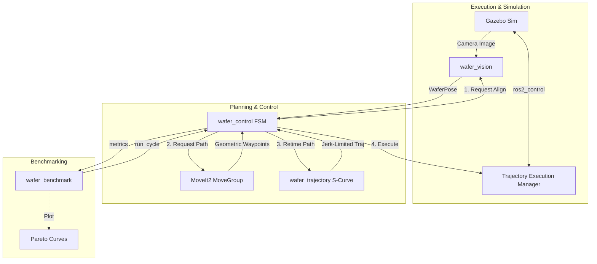

# System Architecture

```mermaid
graph TD
    subgraph Execution & Simulation
        Gazebo[Gazebo Sim] --> |Camera Image| Vision[wafer_vision]
        Gazebo <--> |ros2_control| TEM[Trajectory Execution Manager]
    end

    subgraph Planning & Control
        FSM[wafer_control FSM]
        MoveIt[MoveIt2 MoveGroup]
        Traj[wafer_trajectory S-Curve]
        
        FSM -->|1. Request Align| Vision
        Vision -->|WaferPose| FSM
        
        FSM -->|2. Request Path| MoveIt
        MoveIt -->|Geometric Waypoints| FSM
        
        FSM -->|3. Retime Path| Traj
        Traj -->|Jerk-Limited Traj| FSM
        
        FSM -->|4. Execute| TEM
    end
    
    subgraph Benchmarking
        Bench[wafer_benchmark]
        Bench -->|run_cycle| FSM
        FSM -->|metrics| Bench
        Bench -.->|Plot| CSV[Pareto Curves]
    end
```
